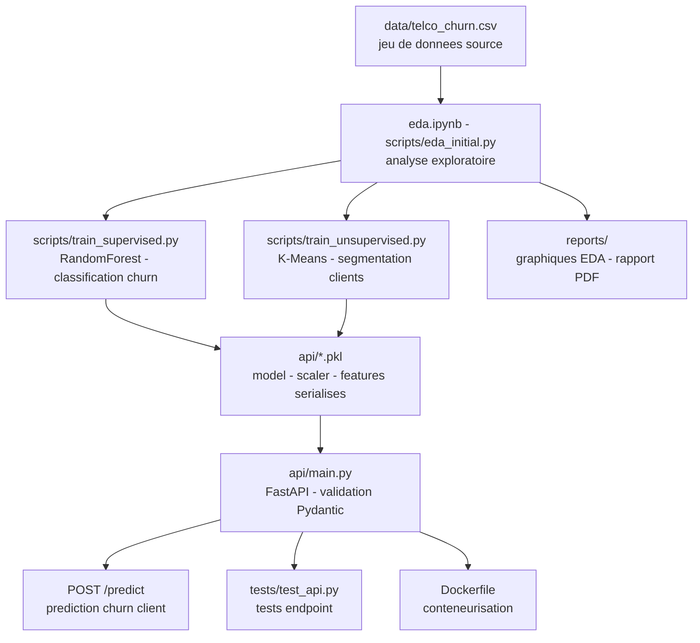

# 📊 Projet Évaluation Finale - Data Science avec Python

[](https://github.com/Adam-Blf/Evaluation_Finale_DataScience_Beloucif/releases)

<!-- adam-badges:start -->
[](https://github.com/Adam-Blf/Evaluation_Finale_DataScience_Beloucif/commits) [](https://hits.sh/github.com/Adam-Blf/Evaluation_Finale_DataScience_Beloucif/) [](https://github.com/Adam-Blf/Evaluation_Finale_DataScience_Beloucif/commits) [](https://github.com/Adam-Blf/Evaluation_Finale_DataScience_Beloucif) [](LICENSE)
<!-- adam-badges:end -->


[](https://www.efrei.fr/)


```text
==========================================================================
AUTEUR      : Adam Beloucif
FORMATION   : Mastère Data Science
PROJET      : Prédiction du Churn Telco
DATE        : Février 2026
==========================================================================
```

## 🚀 Présentation

Ce projet présente une pipeline complète de Data Science pour la prédiction de la perte de clients (Churn) dans le secteur des télécommunications.

## Architecture



## 📁 Structure du Projet

- `data/` : Jeu de données source (`telco_churn.csv`).
- `api/` : Code source de l'API FastAPI et modèles sérialisés (`.pkl`).
- `scripts/` : Scripts d'entraînement et utilitaires.
- `reports/` : Graphiques d'EDA et Rapport Final PDF.
- `Dockerfile` : Pour la conteneurisation.

## 🛠️ Installation & Exécution

1. Installez les dépendances : `pip install -r requirements.txt`
2. Lancez l'API : `python api/main.py`
3. Testez l'endpoint : `POST /predict` avec les données client.

## 📊 Caractéristiques Techniques

- **Modèle Supervisé** : Random Forest (Classification).
- **Modèle Non Supervisé** : K-Means (Segmentation).
- **API** : FastAPI avec validation Pydantic.
- **Reporting** : Rapport PDF généré automatiquement.

---
*Livrable réalisé par Adam Beloucif.*


---

<p align="center">
  <sub>Par <a href="https://adam.beloucif.com">Adam Beloucif</a> - Data Engineer & Fullstack Developer - <a href="https://github.com/Adam-Blf">GitHub</a> - <a href="https://www.linkedin.com/in/adambeloucif/">LinkedIn</a></sub>
</p>


## Star History

<a href="https://www.star-history.com/?repos=Adam-Blf%2FEvaluation_Finale_DataScience_Beloucif&type=date&legend=top-left">
 <picture>
   <source media="(prefers-color-scheme: dark)" srcset="https://api.star-history.com/chart?repos=Adam-Blf/Evaluation_Finale_DataScience_Beloucif&type=date&theme=dark&legend=top-left" />
   <source media="(prefers-color-scheme: light)" srcset="https://api.star-history.com/chart?repos=Adam-Blf/Evaluation_Finale_DataScience_Beloucif&type=date&legend=top-left" />
   
 </picture>
</a>
